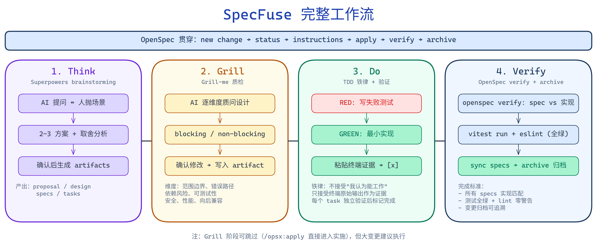

# 构建你的 AI 开发流水线：Harness Engineering工程实践流程工具：Specfuse


> 这篇文章聊AI流水线方法论，如果你已经在用 AI 写代码，尝试过很多工具和插件，开发流程还是不满意的 ——这篇文档可能值得花十分钟看看。


---


## 工具够多了，流程在哪？

用 AI 写代码这件事，在 Harness Engineering的框架下，已经在生产环境能流畅完成需求落地。问题是：你手里的工具越来越多——openspec、superpowers、speckit、grillme、gstack——但他们各有所长又有着许多重合的范围。也看到过很多同学都装了。


可能每个工具都能让你完成一次vibecoding的工作，但在各有所长又互相覆盖的场景下，既想要openspec的规范文档和任务树的自动化生成，又觉得superpowers的brainstorm对你思路的压榨深得你心。
这些工具物理上共存了，痛点就在逻辑上如何协作。
打个比方：你有搅拌机、烤箱、模具——但没有食谱。每个厨具都能用，但没人规定"先搅拌再入模再烘烤"的顺序，出来的东西全凭手感。

所以这篇文章写的是这么一个事情：不发明新工具，给已有的工具编排一条流水线。OpenSpec 提供开发流程的脚手架，Superpowers 负责需求对齐和 TDD 铁律，Grill-me 做设计阶段的查漏补缺——怎么把它们按合理的顺序串起来？于是就有了SpecFuse。 


---

## Specfuse 四拍流水线：Think → Grill → Do → Verify

整条流水线就四拍：

```
Think（想清楚）→ Grill（查漏洞）→ Do（动手做）→ Verify（验收归档）
```

OpenSpec 贯穿全程做流程管理，每一拍都有明确的切入和切出点：



<!-- 图表源文件：pipeline-diagram.excalidraw，可在 excalidraw.com 打开编辑 -->

上面那条线是 OpenSpec 交给每一拍的输入（切入），下面那条线是每一拍交还给 OpenSpec 的输出（切出）。整个流程中，OpenSpec 负责"现在该做什么、做完了没、产出物存哪里"，具体怎么做则由每一拍各自的工具接管。

关键体验是：每个阶段你只敲一个命令，背后的能力调度对你透明。不需要记"现在该激活哪个插件"，流水线替你记。

而且拍与拍之间有明确的阶段感。brainstorm 结束了就进 artifact 生成；artifacts 全部完成后系统建议你跑一轮 grill；grill 过了（或者你跳过），才进入实施。节奏可控，不是一锅乱炖。

---

## Superpowers Brainstorm：不是让 AI 自嗨，是双向对齐

很多人对 brainstorm 的理解就是"让 AI 帮我想方案"。然后一路 yes——AI 提一个方案你说行，AI 展开细节你说行，最后生成一堆 artifacts，你其实都没仔细看。

这样的话 brainstorm 和直接让 AI 一次性生成所有文档有什么区别？没区别。

brainstorm 真正的价值不是生成方案，是双向对齐：

- AI → 人：AI 提出技术方案，你追问细节来理解它的逻辑。这是知识传递——搞清楚"为什么选了这个方案而不是那个"。
- 人 → AI：你抛真实业务场景，让 AI 重新判断哪个方案更合理。这是场景校准——AI 不知道你的用户会怎么用、你的系统有什么历史包袱，你得喂给它。

这个形式，熟不熟？

就是项目评审会。以前我们团队每双周一次——项目负责人提交方案，评审委员逐条质问。现在评审对象变了：以前人写文档人评审，现在 AI 生成方案人来评审。但形式一样：苏格拉底式一问一答，逐步收敛到共识。

不同的是成本。以前要凑齐五六个人的日程，现在你随时开一轮。频率从双周一次变成每个变更都有。问题暴露的时机从"半个月后的评审会"变成"动手之前的十分钟对话"。

---

## Grillme ：出厂前的质检

brainstorm 是生产环节的双向对齐。但人会疲——尤其你和 AI 聊了二十分钟、脑子里全是实现细节的时候，很可能无意识地一路 yes 过去了。

Grill 就是兜底：所有 artifacts 生成完毕后，AI 反过来质问你的设计。

注意角色关系的变化：
- brainstorm 阶段：AI 提问挖掘你的场景知识 → 生产
- grill 阶段：AI 质问已生成的方案 → 质检

Grill 从多个维度审查——范围边界清不清晰、错误路径有没有覆盖、依赖引入合不合理、能不能测、有没有性能陷阱。每次只问一个问题，标注 blocking 或 non-blocking，给出修改预览，你确认后才写入。

这个环节是建议执行，不强制。你对 brainstorm 结果有信心就直接跳过。但对于大变更、或者你确实一路 yes 过来的场景——跑一轮的成本是几分钟，引入Grillme让AI左右互博一轮，你来把握左右互博的结果。在写代码之前堵住设计缺陷。此时改的是几个文本文件，不是回滚几百行已经写好的代码和测试。

---

## Superpowers TDD：在 AI 场景下意义变了

TDD 在传统开发中的核心价值是驱动设计——先写测试来思考接口。

但在 AI 编码场景下，它的核心价值变成另一件事：提供可验证的完成证据。

AI 说"这个任务完成了"——你信吗？它声称跑过测试了——你怎么验证？

答案是要求它粘贴终端原始输出。不接受"我认为它能工作"，不接受"逻辑上没问题"，只接受"这是我刚跑的 vitest 输出，12 个测试全绿"。

所以在 Do 阶段，TDD 不是建议而是铁律：写失败测试 → 最小实现 → 粘贴证据 → 才能标记完成。不是信仰问题，是在 AI 场景下，测试是你唯一能观察到的、它确实做了验证的证据。

测试如果是可选的，AI 在上下文压力大的时候会跳过验证——这是观察到的实际行为，不是猜测。

---

## 编排的意义：为什么不是"装三个插件"

你可能会想：我自己装一个 spec 管理工具、配一个 TDD 约束、再加一个 review 流程，不也一样？

技术上一样。体验上完全不同。

区别在于：谁来记住"现在该激活什么"？

你来记——你会忘。尤其第三个小需求的时候，你会想"这个太简单了不需要 brainstorm"，然后写到一半发现方向错了。

流水线来记——每个命令背后自动调度对应的能力。你调用"开始实施"，TDD 和验证要求就自动生效，不需要你手动开。

这就是融合和组合的区别：组合是你有三个好工具，融合是你有一条流水线，工具在正确的时刻自动接力。

技术上，这条流水线通过声明式规则实现——把"什么阶段激活什么能力、以什么约束强度执行"写成规则。规则分级：绝对不可违反的（TDD 铁律）标 MUST，通常正确但有例外的（"6 个以上独立任务时建议启用并行"）标 SHOULD 并附触发条件。

这不是理想方案，理想方案是系统级强制执行。但当前技术条件下，声明式规则是成本最低、效果最好的路径。

---

## 场景叙事：一个完整流程长什么样

以下是一个真实场景——给运维平台加一个审计日志模块。整个过程从 `/opsx:new` 到归档，大约两小时。

### Think：Brainstorming 收敛设计空间

敲下 `/opsx:new 增加审计日志记录模块`，系统自动激活 brainstorming。接下来是 7 轮苏格拉底式问答：

> **AI：** 记录哪些操作？只记外部 API 调用，还是包含系统内部操作？需要 before/after diff 吗？
>
> **人：** 全部操作含系统操作，需要 before/after diff。

> **AI：** 目的是合规审计、问题排查还是实时告警？
>
> **人：** 排查问题 + 管理员前端检索，暂不需要告警和导出。

> **AI：** 存储方案有三个方向——本地文件、PostgreSQL、ELK。按你的万机集群规模，各有取舍……
>
> **人：**（看完对比后）先写本地做安全底线，异步写 PG 做集中查询，预留迁移 ES 的抽象层。

7 轮下来，从"我要审计日志"收敛到了三层架构：同步写本地 → 异步队列写 PG → 存储抽象层。然后一次性生成 proposal、design、specs、tasks 四类制品。

### Grill：在写代码之前堵漏洞

所有制品生成后，跑一轮 `/grill-me`。AI 反过来质问设计，逐个追问薄弱点。8 轮里最关键的一问：

> **AI：** `[blocking]` 中间件如何跨模块获取 before 状态？每个业务模型结构不同，你打算怎么做通用 diff？
>
> **人：** ……想了想，去掉 diff 吧。审计日志只需要记录"谁在什么时间对什么资源做了什么操作"，before/after 是另一个问题。

**这是整个流程里 ROI 最高的一刻。** 去掉 diff 后，中间件从"需要理解每个业务模型"简化为"纯 request/response 录像机"。设计复杂度下降一个数量级。

### Do：TDD 逐任务推进

`/opsx:apply` 激活后，严格按 Red-Green-Refactor 节奏走：

```
任务 1: 审计模型 + 协议定义
  → 写测试：断言 AuditLogEntry 包含必填字段 → RED
  → 写 dataclass → GREEN
  → 重构：提取 ResourceType enum

任务 3: 异步 PG Writer
  → 写测试：模拟 flush 超时场景 → RED
  → 实现批量写入 + 超时兜底 → GREEN
  → 重构：抽取 BatchBuffer 通用类

...共 21 个任务，29 个测试全绿，lint 零警告。
```

每个任务标记完成前，必须粘贴终端原始输出作为证据。不接受"应该能跑"。

### Verify → Archive

全部任务完成后 `/opsx:archive`，系统自动同步 delta specs 到主规格库，归档变更目录。归档后还跑了一轮浏览器 E2E 验证——登录后台、触发操作、查看审计日志页面，确认条目完整。

### 回头看

| 阶段 | 产出 | 没有它会怎样 |
|------|------|-------------|
| Brainstorming | 三层架构决策 | 直接开写，中途发现本地不够又推翻重来 |
| Grill-me | 去掉 diff，简化中间件 | 写了一半发现 diff 太复杂，硬着头皮做完或删代码 |
| TDD Apply | 29 个测试 + 证据链 | AI 说"完成了"你不知道信不信 |
| Archive | 制品归档 + 规格同步 | 下次改这个模块时不知道之前的设计决策 |

---

## Specfuse的流程思考

这套流程不会降低对开发者的能力要求。说直接点，它对架构认知和系统理解力的门槛要求比"纯手写"还高。

很多人对 AI 辅助开发的想象是降低门槛——让不会写代码的人也能出活，让初级开发者产出高级设计。但这套流程的底色不是这个方向。它是工程决策能力的放大器，不是替代品。

想想看：brainstorm 阶段 AI 给你三个架构方案让你选，你得能判断哪个在你的业务场景下更合理。Grill 阶段它质问你的 error path 覆盖，你得理解为什么这个边界条件在生产环境会出问题。TDD 阶段它帮你生成测试，你得分辨哪些是在验证业务不变量，哪些只是在测实现细节。

每一个环节，AI 都在问你问题。但如果你对系统没有整体认知，你连问题本身都没法正确回答。

这跟传统工具链的逻辑不一样。传统工具降低的是执行成本——自动补全让你打字快，linter 让你少犯格式错误。但这套流程降低的是决策摩擦——它让架构决策发生得更频繁、反馈周期更短。决策频率越高，对决策者的认知水平要求越高，不是越低。

我的判断是：AI 工作流最终会拉大"能做架构决策的人"和"只能执行既定方案的人"之间的差距。流程保证你不遗漏、不跑偏，但它没法替你建立对系统的整体判断力。

但是，站在开发的角度去设计开发流程，是不是一个正确的方向？或许AI能力发展到后面的阶段也许写一个“微信”，“抖音” 可能也是一句话的事情。
---

## 试试看

如果上面的思路对你有一点启发或者不同想法，欢迎体验一下 SpecFuse和留下你的评论：

```bash
npm create specfuse@latest my-project
```

一条命令把整条流水线注入到你的项目。brainstorm、grill、TDD 铁律、artifact 管理，开箱可用。

不想装工具也没关系。这篇文章的核心观点在方法论层面：AI 编码需要的不是更多好用的工具，而是一条把工具编排成连贯节奏的流水线。你完全可以用自己的方式实践这个思路。
这个文档也有很多地方没有涉及到的地方，例如subagent、gittree，以及一些不涉及流程的工具类应用。

---

*如果你有类似的实践，或者对上面的观点有不同看法——评论区聊。*
